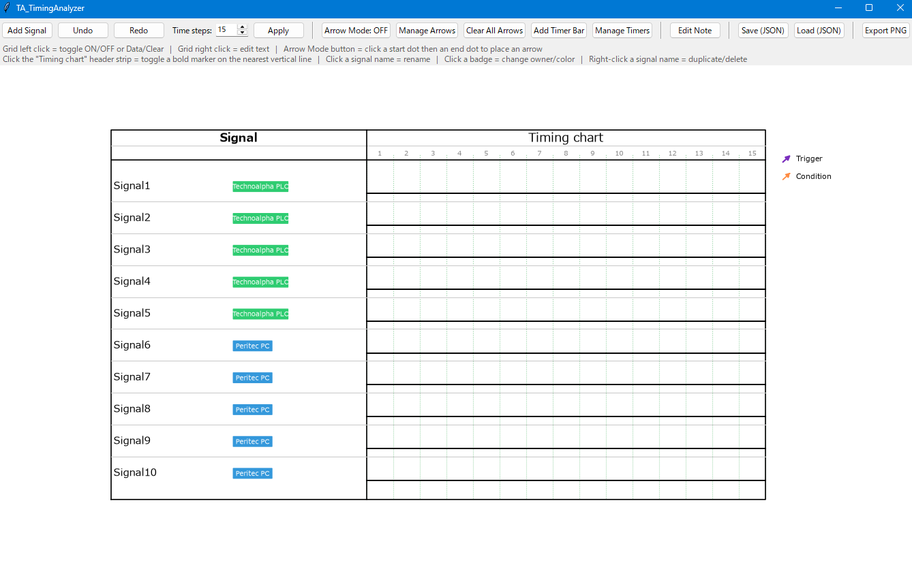

# TA_WaveSketch

タイミングチャート作成ツール

## 🧩 主な機能

- **クリックだけでタイミングチャート作成** - 信号のON/OFF、Data/Clearをクリックで切り替え
- **Trigger / Condition矢印** - Arrow Modeでドットをクリック→クリックするだけで矢印を配置
- **ON角/OFF角への吸着** - 矢印の始点・終点は実際の信号の切り替わり位置に自動で吸着
- **タイマーバー表示** - 「設備設定タイマー」のような色付き帯を任意の範囲に追加
- **Undo / Redo** - 最大20手まで操作を元に戻す/やり直す
- **PNG高解像度出力** - そのままExcel/PowerPointに貼り付け可能（300dpi）
- **JSON保存/読込** - 作成途中のチャートを保存して後で編集を再開できる
- **行の複製・削除・名前変更** - 信号名やバッジ（所属・色）をクリックだけで編集

## 💻 動作環境

- Python 3.8+
- Windows 10/11
- 必要ライブラリ: matplotlib（GUIはPython標準のtkinterを使用）

## 📦 インストール方法

```bash
# リポジトリをクローン
git clone https://github.com/Li-Wang-Tom/TA_WaveSketch.git
cd TA_WaveSketch

# 依存関係をインストール
pip install -r requirements.txt

# アプリケーションを起動
python TA_WaveSketch.py
```

## 🚀 使用方法

1. **アプリケーションを起動**（15行の信号が用意されています）
2. **左クリックでON/OFF・Data/Clearを切り替え**
3. **右クリックでそのセルのテキスト/注釈を編集**
4. **「Arrow Mode」ボタンをON**にして、始点のドット→終点のドットの順にクリックするとTrigger/Condition矢印を配置
5. **「Add Timer Bar」で色付きの帯を追加**、「Manage Timers」「Manage Arrows」で個別に編集・削除
6. **左側の信号名/バッジをクリック**して名前・所属・色を変更、右クリックで複製・削除
7. **「Export PNG」で高解像度画像を保存**してExcel/PowerPointに貼り付け

## 🖼️ アプリ画面



## 🔧 主な技術

- **matplotlib** - チャート描画全般（波形・バス形状・矢印・タイマーバー）
- **カスタム3次ベジェ曲線** - Trigger/Condition矢印を「最初膨らんで終点でまっすぐになる」曲線で描画
- **tkinter.simpledialog** - 信号追加・矢印作成・タイマー追加などの入力ダイアログ
- **matplotlib.path.Path / FancyArrowPatch** - 独自カーブの矢印描画
- **JSON** - チャート状態の保存/読込

## 🛠️ 開発者向け情報

### ファイル構成

```
TA_WaveSketch/
├─ TA_WaveSketch.py                   # メインアプリケーション
├─ requirements.txt                   # 依存関係
├─ README.md                          # このファイル
├─ LICENSE                            # ライセンス
└─ docs/                              # ドキュメント
   └─ screenshot.png                  # スクリーンショット
```

### 主要クラス・関数

- `TimingChartApp` - メインアプリケーションクラス（状態管理・描画・イベント処理）
- `VarAddSignalDialog` / `VarEditOwnerDialog` - 信号の追加・所属編集ダイアログ
- `VarArrowKindDialog` / `VarManageArrowsDialog` - 矢印の作成・一覧編集ダイアログ
- `VarAddTimerDialog` / `VarManageTimersDialog` - タイマーバーの追加・一覧編集ダイアログ
- `methodDrawChart()` - チャート全体の描画（画面表示・PNG出力で共用）
- `methodOnPress()` / `methodHandleArrowModeClick()` - クリック操作の処理
- `methodExportPng()` - 高解像度PNG書き出し
- `methodSaveJson()` / `methodLoadJson()` - チャート状態の保存/読込
- `methodUndo()` / `methodRedo()` - 元に戻す/やり直す

## 🤝 貢献方法

1. フォークしてください
2. フィーチャーブランチを作成（`git checkout -b feature/amazing-feature`）
3. 変更をコミット（`git commit -m 'Add amazing feature'`）
4. ブランチにプッシュ（`git push origin feature/amazing-feature`）
5. プルリクエストを作成

## 📝 License

This project is licensed under the MIT License.
See the [LICENSE](LICENSE) file for details.

## 👨‍💻 作者

**TA Li-Wang-Tom**

- GitHub: [@Li-Wang-Tom](https://github.com/Li-Wang-Tom)

## 🙏 謝辞

このプロジェクトは Python と matplotlib、tkinter の優れたライブラリを活用しています。

- **Python 社区** - 強力なプログラミング言語を提供してくれました
- **matplotlib 開発チーム** - 高機能な描画ライブラリを提供してくれました
- **GitHub** - オープンソースプロジェクトのための完璧なホスティングを提供してくれました

感謝所有為開源事業貢献力量的開發者們！

没有你們的努力，就没有這個項目的誕生。

謝謝大家！🎉
